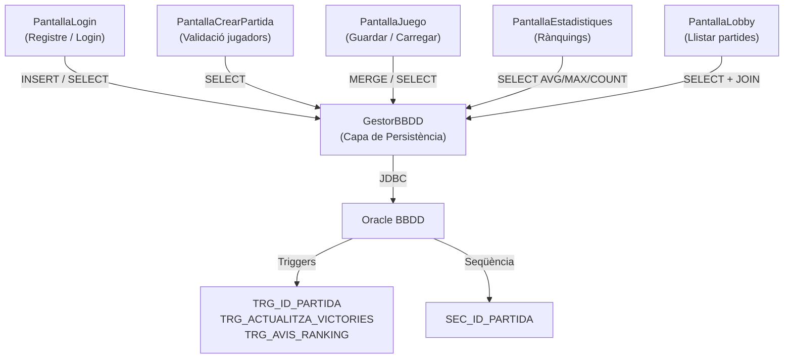

# 📘 DOCUMENTACIÓ TÈCNICA — JOC D'EN PINGU
## Part 2: PL/SQL — NIVELL AVANÇAT (Integració des del joc)

---

## COM ES GESTIONA CADA FUNCIONALITAT DES DEL JOC

### A.1 Seqüència SEC_ID_PARTIDA — Invocació des de Java

**Quan i com s'executa:**
Quan l'usuari guarda una partida per primera vegada (sense ID assignat), el mètode `guardarBBDD()` de `GestorBBDD.java` invoca la seqüència directament via SQL.

**D'on treu la informació:**
Es crida `SEC_ID_PARTIDA.NEXTVAL` des d'un `SELECT` a `DUAL`. No rep paràmetres externs.

**Què es fa amb el resultat:**
El valor retornat s'assigna com a `id` de l'objecte `Partida` i s'utilitza en tots els `MERGE` posteriors.

**Codi Java (GestorBBDD.java, línies 277-287):**
```java
// Si la partida no té ID, obtenim el següent de la seqüència Oracle
if (idPartida <= 0) {
    ArrayList<LinkedHashMap<String, String>> resSeq =
        select(conexion, "SELECT SEC_ID_PARTIDA.NEXTVAL AS NEXT_ID FROM dual");
    if (!resSeq.isEmpty() && resSeq.get(0).get("NEXT_ID") != null) {
        idPartida = Integer.parseInt(resSeq.get(0).get("NEXT_ID"));
        p.setId(idPartida); // Assignem l'ID generat a l'objecte Partida
    }
}
```

---

### A.2 Trigger TRG_ID_PARTIDA — Invocació implícita

**Quan i com s'executa:**
Aquest trigger es dispara **automàticament** quan el joc insereix una nova partida amb `ID_PARTIDA = NULL`. En la pràctica, el joc utilitza la seqüència explícitament (A.1), però si per qualsevol motiu l'ID arriba com a NULL, el trigger actua com a xarxa de seguretat.

**Demostració:**
Quan el `MERGE` fa un `INSERT` a `PARTIDA` amb un ID explícit, el trigger detecta que `:NEW.ID_PARTIDA` no és NULL i no fa res. Si fos NULL, assignaria `SEC_ID_PARTIDA.NEXTVAL`.

---

### A.3 Trigger TRG_ACTUALITZA_VICTORIES — Flux de victòria

**Quan i com s'executa:**
Quan un jugador arriba a la casella final (casella 49), `PantallaJuego.java` crida el flux:

1. `actualizarEstadoTablero()` → Detecta guanyador → `partida.setFinalizada(true)`
2. `gestorPartida.guardarPartida()` → `guardarBBDD()` → `MERGE INTO partida ... SET finalitzada = 1`
3. El trigger `TRG_ACTUALITZA_VICTORIES` es dispara automàticament i fa `UPDATE JUGADOR SET VICTORIES = VICTORIES + 1`

**Codi Java (PantallaJuego.java, línies 1170-1180):**
```java
private void mostrarVictoria(Jugador ganador) {
    // Es marca la partida com a finalitzada amb guanyador
    gestorPartida.getPartida().setFinalizada(true);
    gestorPartida.getPartida().setGanador(ganador);
    // En guardar, el MERGE actualitza FINALITZADA a 1 → dispara el trigger
    gestorPartida.guardarPartida();
    // Mostra l'overlay de victòria amb animació
    winOverlay.setVisible(true);
}
```

**Codi Java (GestorPartida.java, línies 272-280):**
```java
public void actualizarEstadoTablero() {
    int meta = partida.getTablero().getTotalCasillas() - 1;
    for (Jugador j : partida.getJugadores()) {
        if (j.getPosicion() >= meta && !(j instanceof Foca)) {
            partida.setGanador(j);
            partida.setFinalizada(true);
            partida.anadirEvento("¡" + j.getNombre() + " HA GUANYAT LA PARTIDA!");
        }
    }
}
```

---

### A.4 Funció GET_MAX_VICTORIES_RECORD — Des de PantallaEstadistiques

**Quan i com s'executa:**
Quan l'usuari obre la pantalla d'estadístiques des del menú principal.

**D'on treu la informació:**
Crida `getMaxVictoriesRecordSQL()` a `GestorBBDD.java`, que fa un `SELECT MAX(victories)` amb el filtre d'usuaris reals.

**Què es fa amb el resultat:**
Es mostra a la `Label lblRecordGlobal` de la interfície.

**Codi Java (PantallaEstadistiques.java, línies 59-60):**
```java
// Es crida al mètode que executa: SELECT MAX(victories) as MAX_V FROM jugador WHERE [filtre]
int record = db.getMaxVictoriesRecordSQL();
lblRecordGlobal.setText(String.valueOf(record)); // Mostra "3" per exemple
```

**Codi Java (GestorBBDD.java, línies 396-400):**
```java
public int getMaxVictoriesRecordSQL() {
    ArrayList<LinkedHashMap<String, String>> res =
        select(conexion, "SELECT MAX(victories) as MAX_V FROM jugador WHERE " + FILTRE_USUARIS);
    if (res.isEmpty() || res.get(0).get("MAX_V") == null) return 0;
    return Integer.parseInt(res.get(0).get("MAX_V"));
}
```

---

### A.5 Procediment GET_JUGADORS_RECORD — Des de PantallaEstadistiques

**Quan i com s'executa:**
En la inicialització de la pantalla d'estadístiques, dins de `cargarRankings()`.

**Codi Java (PantallaEstadistiques.java, línies 94-97):**
```java
// Obtenim els jugadors que tenen el rècord i els mostrem a la taula visual
ArrayList<LinkedHashMap<String, String>> resRecord = db.getJugadorsRecordSQL();
ObservableList<Map> itemsRecord = FXCollections.observableArrayList(resRecord);
tblRankingRecord.setItems(itemsRecord); // Pobla la TableView amb els resultats
```

**Codi Java (GestorBBDD.java, línies 406-409):**
```java
public ArrayList<LinkedHashMap<String, String>> getJugadorsRecordSQL() {
    int max = getMaxVictoriesRecordSQL(); // Primer obtenim el rècord
    return select(conexion, "SELECT nom_jugador, victories FROM jugador "
        + "WHERE victories = " + max + " AND victories > 0 AND (" + FILTRE_USUARIS + ")");
}
```

---

### A.6 Funció GET_MITJA_VICTORIES — Des de PantallaEstadistiques

**Codi Java (PantallaEstadistiques.java, línies 56-57):**
```java
double mitja = db.getMitjaVictoriesSQL();
lblMitjaGlobal.setText(String.format("%.2f", mitja)); // Mostra p.ex. "1.75"
```

**Codi Java (GestorBBDD.java, línies 388-392):**
```java
public double getMitjaGlobalSQL() {
    ArrayList<LinkedHashMap<String, String>> res =
        select(conexion, "SELECT AVG(victories) as MITJA FROM jugador WHERE " + FILTRE_USUARIS);
    if (res.isEmpty() || res.get(0).get("MITJA") == null) return 0.0;
    return Double.parseDouble(res.get(0).get("MITJA"));
}
```

---

### A.7 Procediment GET_JUGADORS_SOBRE_MITJA — Des de PantallaEstadistiques

**Codi Java (PantallaEstadistiques.java, línies 99-102):**
```java
ArrayList<LinkedHashMap<String, String>> resSobreMitja = db.getJugadorsSobreMitjaSQL();
ObservableList<Map> itemsSobreMitja = FXCollections.observableArrayList(resSobreMitja);
tblRankingSobreMitja.setItems(itemsSobreMitja);
```

---

### A.8 Funció PERCENTATGE_MENYS_VICTORIES — Des de PantallaEstadistiques

**Quan i com s'executa:**
Quan l'usuari introdueix un número al camp `txtPuntuacio` i prem el botó de calcular.

**D'on treu la informació:**
El paràmetre `vics` ve del text introduït per l'usuari al `TextField`.

**Què es fa amb el resultat:**
Es mostra a `lblResultatPercentatge` amb format: "SUPERES AL 75.0% DELS JUGADORS!"

**Codi Java (PantallaEstadistiques.java, línies 108-117):**
```java
@FXML
private void handleCalcularPercentatge(ActionEvent event) {
    try {
        int vics = Integer.parseInt(txtPuntuacio.getText()); // Valor del camp de text
        double perc = db.getPercentatgeMenysVictoriesSQL(vics); // Crida a la funció equivalent
        lblResultatPercentatge.setText(
            String.format("SUPERES AL %.1f%% DELS JUGADORS!", perc));
    } catch (NumberFormatException e) {
        lblResultatPercentatge.setText("INTRODUEIX UN NÚMERO VÀLID.");
    }
}
```

**Codi Java (GestorBBDD.java, línies 416-424):**
```java
public double getPercentatgeMenysVictoriesSQL(int vics) {
    // Dos SELECTs: total de jugadors i jugadors amb menys victòries
    ArrayList<...> resTotal = select(conexion,
        "SELECT COUNT(*) as TOTAL FROM jugador WHERE " + FILTRE_USUARIS);
    ArrayList<...> resMenys = select(conexion,
        "SELECT COUNT(*) as MENYS FROM jugador WHERE victories < " + vics
        + " AND (" + FILTRE_USUARIS + ")");
    double total = Double.parseDouble(resTotal.get(0).get("TOTAL"));
    double menys = Double.parseDouble(resMenys.get(0).get("MENYS"));
    return (menys / total) * 100.0; // Retorna el percentatge calculat
}
```

---

### A.9 Trigger TRG_AVIS_RANKING — Execució automàtica

**Quan i com s'executa:**
Es dispara automàticament a Oracle cada cop que `TRG_ACTUALITZA_VICTORIES` incrementa les victòries d'un jugador. La sortida apareix a la consola `DBMS_OUTPUT` d'Oracle Developer (no es mostra directament al joc JavaFX).

---

### A.10 Rànquing per partides totals — Des de PantallaEstadistiques

**Codi Java (PantallaEstadistiques.java, línies 89-92):**
```java
ArrayList<LinkedHashMap<String, String>> resPartides = db.getRankingPartidesTotalsSQL();
ObservableList<Map> itemsPartides = FXCollections.observableArrayList(resPartides);
tblRankingPartides.setItems(itemsPartides);
```

**Codi Java (GestorBBDD.java, línies 402-404):**
```java
public ArrayList<LinkedHashMap<String, String>> getRankingPartidesTotalsSQL() {
    return select(conexion,
        "SELECT nom_jugador, victories as TOTAL FROM jugador WHERE " + FILTRE_USUARIS
        + " ORDER BY victories DESC FETCH FIRST 10 ROWS ONLY");
}
```

---

### A.11 Estadístiques amb control d'errors — Validació de jugadors

**Quan i com s'executa:**
Des de `PantallaCrearPartida.java` quan es valida l'existència d'un jugador per crear una partida. El control d'errors PL/SQL (codis -20001 i -20002) s'implementa al procediment Oracle, però la validació equivalent al joc es fa via `getIDJugador()` i `loginUsuario()`.

**Codi Java (PantallaCrearPartida.java, línies 121-129):**
```java
// Error equivalent a -20001: jugador no existeix
if (db.getIDJugador(user) == -1) {
    mostrarAlert(Alert.AlertType.ERROR, "USUARI INEXISTENT",
        "L'USUARI '" + user + "' NO ESTÀ REGISTRAT.");
    errorValidacion = true;
// Error equivalent a -20002: contrasenya incorrecta (no ha pogut accedir)
} else if (!db.loginUsuario(user, pass)) {
    mostrarAlert(Alert.AlertType.ERROR, "CONTRASENYA INCORRECTA",
        "LA CONTRASENYA PER A '" + user + "' NO ÉS VÀLIDA.");
    errorValidacion = true;
}
```

---

## RESUM: Flux complet d'integració BBDD ↔ Joc



---

> [!TIP]
> Totes les funcionalitats PL/SQL es mostren directament des del joc JavaFX (pantalla d'estadístiques, lobby i pantalla de joc), assolint el **nivell avançat (nota màxima 10)**.
